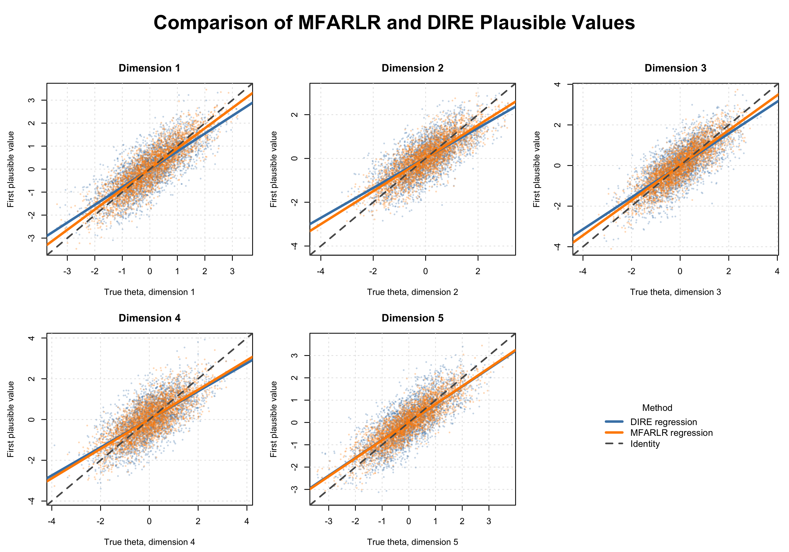

```{r setup, include=FALSE}
knitr::opts_chunk$set(
  collapse = TRUE,
  comment = "#>",
  eval = FALSE
)
```

# Introduction

The `FARL` package implements factor-augmented regularized latent regression
(FARLR) for large-scale assessments. FARLR addresses high-dimensional,
strongly dependent background variables by decomposing their variation into
common latent factors and idiosyncratic components. The common factors enter
the latent regression, while sparse regularization selects a parsimonious set
of relevant idiosyncratic covariates.

For multidimensional assessments, MFARLR extends this structure to
several correlated latent traits. It estimates the regression coefficients and the full residual covariance jointly, avoiding separate pairwise covariance fits and preserving dependence among dimensions when plausible values are generated for group-level analyses.

The package supports:

- unidimensional FARLR estimation through `Farlr_mml()`;
- unidimensional PCA-based DIRE estimation through `Dire_mml()`;
- multidimensional FARLR-GVEM estimation through `MFARLR_mml()`;
- multidimensional DIRE estimation through `MDIRE_mml()`; and
- plausible-value generation for all fitted models.

The development version can be installed with

```{r installation}
if (!requireNamespace("devtools", quietly = TRUE)) {
  install.packages("devtools")
}

devtools::install_github(
  "MAP-LAB-UW/FARL",
  build_vignettes = TRUE
)

torch::install_torch()
```

```{r load-package}
library(FARL)
```

# Data Input

The public fitting interfaces use the following inputs.

| Function | Covariates | Responses | Item parameters | Main covariates |
| :-- | :--: | :--: | :--: | :--: |
| `Farlr_mml()` | `X` | `Y` | `parTab` | `main` |
| `MFARLR_mml()` | `X` | `Y` | `parTab` | `farlr_args$main` |
| `MDIRE_mml()` | `X` | `Y` | `parTab` | `main` |

The low-level unidimensional `Dire_mml()` interface additionally uses the DIRE
person, item, parameter, test-scale, and formula objects demonstrated below.

## One-dimensional 2PL data: `sim_a1`

`sim_a1` contains 300 respondents, 100 background covariates, and six
dichotomous 2PL items. The true latent trait is retained for evaluating the
simulation results.

```{r sim-a1-input}
data(sim_a1)

dim(sim_a1$X)
# [1] 300 100

dim(sim_a1$Y)
# [1] 300   6

length(sim_a1$theta)
# [1] 300

main = c(1,2,15,29,45)
main
# [1]  1  2 15 29 45

head(sim_a1$Y)
#      i001 i002 i003 i004 i005 i006
# [1,]    1    1    0    0    0    1
# [2,]    0    1    0    1    0    0
# [3,]    1    0    1    0    0    1
# [4,]    0    0    0    0    1    1
# [5,]    0    0    0    0    0    1
# [6,]    0    0    0    0    1    1
head(sim_a1$X[, 1:10])
#      [,1] [,2] [,3] [,4] [,5]       [,6] [,7] [,8] [,9]      [,10]
# [1,]    0    1    0    1    0  0.2837093    0    0    1  0.3312277
# [2,]    1    1    1    1    1  0.9718186    1    1    1  0.5673807
# [3,]    1    1    1    1    1  1.2179341    1    1    1  0.7949050
# [4,]    1    1    1    1    1  1.7088599    1    1    1  0.5452621
# [5,]    0    0    0    0    0 -3.5649492    0    0    0 -1.1853080
# [6,]    1    1    1    1    1  1.2663585    1    1    1  0.2501640
sim_a1$parTab
# item b          a       c ItemID test subtest slop    difficulty guessing
# 1	0.68394525	0.7808753	0	item1	comp	main	0.7808753	0.68394525	0	
# 2	0.92141771	1.0839744	0	item2	comp	main	1.0839744	0.92141771	0	
# 3	1.57513353	0.6168007	0	item3	comp	main	0.6168007	1.57513353	0	
# 4	1.63897827	1.1808368	0	item4	comp	main	1.1808368	1.63897827	0	
# 5	0.06180150	0.8086742	0	item5	comp	main	0.8086742	0.06180150	0	
# 6	0.02206284	1.0941187	0	item6	comp	main	1.0941187	0.02206284	0	
```

Rows of `X` and `Y` must refer to the same respondents. Rows of `parTab` must
follow the item-column order in `Y`. For a 2PL item, `a` is discrimination,
`b` is difficulty, `d = -a * b` is the intercept used by `mirt`, and `c = 0`.

## Mixed 3PL/GPCM data: `sim_a2`

`sim_a2` uses the same 300 respondents and 100 covariates, with six items:
three 3PL items and three three-category GPCM items.

```{r sim-a2-input}
data(sim_a2)

dim(sim_a2$X)
# [1] 300 100

dim(sim_a2$Y)
# [1] 300   6

table(sim_a2$itemtype)
#  3PL gpcm
#    3    3

sim_a2$parTab[, c(
  "ItemID", "itemtype", "a", "b", "c", "b1", "b2"
)]
# ItemID itemtype a     b         c       b1  b2
# item1	3PL	0.7808753	0.6839453	0.2364617	NA	NA
# item2	gpcm	1.0839744	NA	0.0000000	0.4103240	1.2342899
# item3	3PL	0.6168007	0.9214177	0.1773176	NA	NA
# item4	gpcm	1.1808368	NA	0.0000000	-1.1282366	-0.0933918
# item5	3PL	0.8086742	1.5751335	0.1758274	NA	NA
# item6	gpcm	1.0941187	NA	0.0000000	-0.1558467	0.768091
```

A nonzero `c` identifies a 3PL item. Finite `b1` and `b2` values identify a
three-category GPCM item.

# Unidimensional FARLR

`Farlr_mml()` provides a common interface for two estimators.

| Method | Description |
| :-- | :-- |
| `FARLR_EMM` | Importance-sampling E-step, regularized selection update, and an unpenalized update for active coefficients |
| `FARLR_Debias` | Regularized estimation followed by correction of shrinkage bias |

The main covariates are supplied as column indices through `main`. These
variables remain in the population model and are not removed by penalized
selection.

## FARLR-EMM

```{r farlr-emm}
mmlcomp_emm <- with(
  sim_a1,
  Farlr_mml(
    X = X,
    Y = Y,
    parTab = parTab,
    method = "FARLR_EMM",
    main = main,
    seed = 2026
  )
)
# |++++++++++++++++++++++++++++++++++++++++++++++++++| 100% elapsed=00s  
# |=====================================================================================================| 100%
round(mmlcomp_emm$coefficients, 3)
 #   FS1    FS2     X1     X2     X3     X4     X5     X6     X7     X8     X9    X10    X11    X12    X13 
 # 0.157  0.518 -0.022  0.078  0.000  0.000  0.000  0.000  0.000  0.000  0.000  0.000  0.000  0.000  0.000 
 #   X14    X15    X16    X17    X18    X19    X20    X21    X22    X23    X24    X25    X26    X27    X28 
 # 0.000 -0.177  0.000  0.000  0.000  0.000  0.000  0.000  0.000  0.000  0.000  0.000  0.000  0.000  0.000 
 #   X29    X30    X31    X32    X33    X34    X35    X36    X37    X38    X39    X40    X41    X42    X43 
 # 0.106  0.000  0.000  0.000  0.000  0.000  0.000  0.000  0.000  0.000  0.000  0.000  0.000  0.000  0.000 
 #   X44    X45    X46    X47    X48    X49    X50    X51    X52    X53    X54    X55    X56    X57    X58 
 # 0.000  0.011  0.000  0.000  0.000  0.000  0.000  0.000  0.000  0.000  0.000  0.000  0.000  0.000  0.000 
 #   X59    X60    X61    X62    X63    X64    X65    X66    X67    X68    X69    X70    X71    X72    X73 
 # 0.000  0.000  0.000  0.000  0.000  0.000  0.000  0.000  0.000  0.000  0.000  0.000  0.000  0.000  0.000 
 #   X74    X75    X76    X77    X78    X79    X80    X81    X82    X83    X84    X85    X86    X87    X88 
 # 0.000  0.000  0.000  0.000  0.000  0.000  0.000  0.000  0.000  0.000  0.000  0.000  0.000  0.000  0.000 
 #   X89    X90    X91    X92    X93    X94    X95    X96    X97    X98    X99   X100 
 # 0.000  0.000  0.000  0.000  0.000  0.000  0.000  0.000  0.000  0.000  0.000  0.000 

round(mmlcomp_emm$sigma, 3)
# [1] 0.725
```

## FARLR-Debias

```{r farlr-debias}
mmlcomp_debias <- with(
  sim_a1,
  Farlr_mml(
    X = X,
    Y = Y,
    parTab = parTab,
    method = "FARLR_Debias",
    main = main,
    seed = 2026
  )
)
#  |++++++++++++++++++++++++++++++++++++++++++++++++++| 100% elapsed=00s  
#  |=====================================================================================================| 100%

round(mmlcomp_debias$coefficients, 3)
#    FS1    FS2     X1     X2     X3     X4     X5     X6     X7     X8     X9    X10    X11    X12    X13 
#  0.170  0.517 -0.016  0.091  0.000  0.000  0.000  0.000  0.000  0.000  0.000  0.000  0.000  0.000  0.000 
#    X14    X15    X16    X17    X18    X19    X20    X21    X22    X23    X24    X25    X26    X27    X28 
#  0.000 -0.189  0.000  0.000  0.000  0.170  0.000  0.000  0.000  0.000 -0.332  0.000  0.000  0.000  0.228 
#    X29    X30    X31    X32    X33    X34    X35    X36    X37    X38    X39    X40    X41    X42    X43 
#  0.118  0.000  0.000  0.000  0.000 -0.152  0.271  0.000  0.000  0.000  0.000  0.000  0.128  0.000  0.150 
#    X44    X45    X46    X47    X48    X49    X50    X51    X52    X53    X54    X55    X56    X57    X58 
#  0.000  0.033  0.000  0.000  0.000 -0.164 -0.010  0.000  0.000  0.000 -0.153  0.000  0.000  0.000  0.000 
#    X59    X60    X61    X62    X63    X64    X65    X66    X67    X68    X69    X70    X71    X72    X73 
# -0.258  0.000  0.000  0.000  0.000  0.000  0.000  0.000  0.000  0.000  0.000 -0.194  0.640  0.000  0.000 
#    X74    X75    X76    X77    X78    X79    X80    X81    X82    X83    X84    X85    X86    X87    X88 
#  0.000  0.000  0.435  0.000  0.000 -0.263  0.000  0.000  0.000  0.000  0.000  0.000  0.000  0.000  0.394 
#    X89    X90    X91    X92    X93    X94    X95    X96    X97    X98    X99   X100 
# -0.419  0.000  0.000  0.000  0.000  0.000  0.000  0.000  0.000  0.000  0.000  0.000
   
round(mmlcomp_debias$sigma, 3)
# [1] 0.62
```

## Mixed 3PL/GPCM responses

The same input interface is used for `sim_a2`. `Farlr_mml()` determines each
item type from `parTab`.

```{r farlr-mixed}
mmlcomp_mixed <- with(
  sim_a2,
  Farlr_mml(
    X = X,
    Y = Y,
    parTab = parTab,
    method = "FARLR_Debias",
    main = main,
    seed = 2026
  )
)
# |=====================================================================================================| 100%
PVs_mixed <- Farlr_drawPVs(
  mmlcomp = mmlcomp_mixed,
  npv = 5L,
  seed = 2026
)
# |=============================================================| 100%

PVs_mixed$datPVs |>
  head() |>
  dplyr::mutate(
    dplyr::across(
      where(is.numeric),
      \(x) round(x, 3)
    )
  )
#  id _farl1  _farl2  _farl3  _farl4  _farl5
# 1	1	-0.450	-1.182	-0.624	-0.727	-0.993
# 2	2	-0.011	0.793	0.664	1.176	0.911
# 3	3	-0.357	-0.500	-0.274	-0.276	-1.306
# 4	4	0.619	0.303	0.130	-0.313	0.334
# 5	5	-1.238	-1.160	-1.740	-0.390	-1.060
# 6	6	1.463	1.384	0.642	0.902	1.382
```

# Multidimensional Comparison

Multidimensional large-scale assessments must model both high-dimensional,
correlated background variables and dependence among latent traits. A PCA-only
population model can discard low-variance covariate information that remains
predictive of achievement, while fitting latent-trait covariances separately
can yield an incoherent covariance estimate. MFARLR instead combines common
factors with sparsely selected covariates and estimates the dimensions jointly.

The multidimensional functions retain the same compact data interface. Both
models receive `X`, `Y`, and `parTab`; item slopes, intercepts, and dimension
assignments are obtained from `parTab` internally.

```{r sim-m1-input}
data(sim_m1)

dim(sim_m1$X)
# [1] 3000   60
dim(sim_m1$Y)
# [1] 3000   30
dim(sim_m1$theta)
# [1] 3000    5
head(sim_m1$parTab)
# 1	1	1	0.9090085	1.0852796	-0.9865284	0	item1	mcomp	dimension1	
# 2	2	1	-1.4605271	0.9679681	1.4137436	0	item2	mcomp	dimension1	
# 3	3	1	0.7797827	0.8828721	-0.6884484	0	item3	mcomp	dimension1	
# 4	4	1	-0.2210281	1.1166641	0.2468141	0	item4	mcomp	dimension1	
# 5	5	1	-0.7199442	1.0148336	0.7306235	0	item5	mcomp	dimension1	
# 6	6	1	0.8171910	1.1513335	-0.9408594	0	item6	mcomp	dimension1	

```

## Fit MFARLR-GVEM

MFARLR uses three steps. First, factor analysis summarizes the common variation
in the standardized covariates. Second, `FARLR_Debias` screens covariates within
each latent dimension, retaining predictors selected for at least one
dimension. Third, the selected sparsity pattern is held fixed while GVEM
jointly updates the coefficient matrix, person-specific variational moments,
and the full latent residual covariance. The Gaussian variational posterior
makes these updates computationally feasible without multidimensional
quadrature.

```{r mfarlr-fit}
mfarlr_mmlcomp <- MFARLR_mml(
  X = sim_m1$X,
  Y = sim_m1$Y,
  parTab = sim_m1$parTab,
  farlr_args = list(
    n_sam = 5L,
    lambda = c(0.05, 0.10),
    main = sim_m1$main,
    delta.criteria = 1e-2,
    iter.max = 20L,
    window.size = 200L,
    progress = FALSE,
    verbose = FALSE,
    seed = 123,
    proposal_inflation = 0.2,
    n_sam_final = 10L
  ),
  selection_tol = 1e-8,
  max_iter = 500L,
  threshold = 1e-3,
  ridge = 1e-6,
  verbose = TRUE
)
#   |++++++++++++++++++++++++++++++++++++++++++++++++++| 100% elapsed=00s  
# Dimension 1: selected 16 of 64 coefficients.
#   |++++++++++++++++++++++++++++++++++++++++++++++++++| 100% elapsed=00s  
# Dimension 2: selected 15 of 64 coefficients.
#   |++++++++++++++++++++++++++++++++++++++++++++++++++| 100% elapsed=00s  
# Dimension 3: selected 16 of 64 coefficients.
#   |++++++++++++++++++++++++++++++++++++++++++++++++++| 100% elapsed=00s  
# Dimension 4: selected 9 of 64 coefficients.
#   |++++++++++++++++++++++++++++++++++++++++++++++++++| 100% elapsed=00s  
# Dimension 5: selected 16 of 64 coefficients.
# Running joint GVEM iterations
#   |=============================================================================================| 100%
# Converged at iteration 112.

mfarlr_mmlcomp$convergence
# [1] "Converged"

mfarlr_mmlcomp$sigma
#           [,1]      [,2]      [,3]      [,4]      [,5]
# [1,] 0.2190553 0.1585642 0.1757711 0.2325277 0.1732133
# [2,] 0.1585642 0.1985374 0.1529688 0.1974590 0.1520352
# [3,] 0.1757711 0.1529688 0.2157257 0.2137705 0.1667811
# [4,] 0.2325277 0.1974590 0.2137705 0.3411085 0.2100602
# [5,] 0.1732133 0.1520352 0.1667811 0.2100602 0.1827474

colSums(mfarlr_mmlcomp$index != 0)
# Dimension1 Dimension2 Dimension3 Dimension4 Dimension5 
#        16         15         16          9         16 
```

## Draw MFARLR plausible values

`MFARLR_drawPVs()` combines the fitted multivariate latent-regression prior with
each respondent's item-response likelihood. Monte Carlo draws from the prior
are likelihood-weighted to approximate the posterior mean and covariance, from
which correlated plausible values are generated. These draws are intended for
population and subgroup inference rather than individual scoring. The fitted
object retains `Y`, the loading matrix, and the item intercepts, so they do not
need to be supplied again.

```{r mfarlr-pv}
mfarlr_PVs <- MFARLR_drawPVs(
  mmlcomp = mfarlr_mmlcomp,
  npv = 10L,
  n_mc = 20000L,
  theta = sim_m1$theta,
  seed = 123,
  progress = TRUE
)

head(mfarlr_PVs$datPVs)
# 1	1	1.8331415	1.0255773	1.7989627	
# 2	2	-1.4005349	-0.9627111	-1.3675437	
# 3	3	0.8416554	0.7384778	0.8474027	
# 4	4	0.6554288	0.6192607	0.5148276	
# 5	5	-1.9824367	-0.9432195	-1.7840723	
# 6	6	-0.6649487	-0.6527626	-1.1258259	

mfarlr_PVs$mean_difference
# Dimension1  Dimension2  Dimension3  Dimension4  Dimension5 
# 0.002031074 0.002331433 0.001994496 0.002648474 0.002528947 
```

## Fit multidimensional DIRE

Multidimensional DIRE provides the PCA-based comparison model. It uses the
same responses and item parameters, allowing the resulting plausible values to
be compared with MFARLR under a common data setup.

```{r mdire-fit}
dire_mmlcomp <- MDIRE_mml(
  X = sim_m1$X,
  Y = sim_m1$Y,
  parTab = sim_m1$parTab,
  main = sim_m1$main,
  pca_type = "cov",
  use_residual = TRUE,
  var_threshold = 0.90,
  calcCor = TRUE
)

dire_PVs <- MDIRE_drawPVs(
  object = dire_mmlcomp,
  npv = 10L,
  group_vars = sim_m1$main
)
# Calculating posterior distribution for construct A (1 of 5)
# Calculating posterior distribution for construct B (2 of 5)
# Calculating posterior distribution for construct C (3 of 5)
# Calculating posterior distribution for construct D (4 of 5)
# Calculating posterior distribution for construct E (5 of 5)
# Calculating posterior correlation between construct A and B (1 of 10)
# Calculating posterior correlation between construct A and C (2 of 10)
# Calculating posterior correlation between construct A and D (3 of 10)
# Calculating posterior correlation between construct A and E (4 of 10)
# Calculating posterior correlation between construct B and C (5 of 10)
# Calculating posterior correlation between construct B and D (6 of 10)
# Calculating posterior correlation between construct B and E (7 of 10)
# Calculating posterior correlation between construct C and D (8 of 10)
# Calculating posterior correlation between construct C and E (9 of 10)
# Calculating posterior correlation between construct D and E (10 of 10)
# Generating plausible values.
```

## Compare multidimensional plausible values

The two PV outputs are first restored to the original `sim_m1` subject order.
PV1 is then extracted separately for every latent dimension. Correlation and
RMSE provide a compact simulation check of latent-distribution recovery; in an
applied analysis, inference should combine estimates across all plausible
values rather than treating a single draw as an observed score.

```{r multidimensional-pv-comparison}
N <- nrow(sim_m1$X)
D <- ncol(sim_m1$theta)
subject_order <- as.character(seq_len(N))

order_PVs <- function(dat) {
  row_order <- match(subject_order, as.character(dat$id))
  if (anyNA(row_order)) {
    stop("Some subjects are missing from the PV output.")
  }
  dat <- dat[row_order, , drop = FALSE]
  rownames(dat) <- NULL
  dat
}

mfarlr_dat <- order_PVs(mfarlr_PVs$datPVs)
dire_dat <- order_PVs(dire_PVs$data)

mfarlr_first_PV <- sapply(
  seq_len(D),
  function(dimension) {
    mfarlr_dat[[paste0("_mfarlr_D", dimension, "_PV1")]]
  }
)

dire_first_PV <- sapply(
  seq_len(D),
  function(dimension) {
    subtest <- dire_mmlcomp$subtest_names[dimension]
    dire_dat[[paste0(subtest, "_dire1")]]
  }
)

dimension_names <- paste0("Dimension", seq_len(D))
colnames(mfarlr_first_PV) <- dimension_names
colnames(dire_first_PV) <- dimension_names

multidimensional_comparison <- do.call(
  rbind,
  lapply(seq_len(D), function(dimension) {
    truth <- sim_m1$theta[, dimension]
    mfarlr_error <- mfarlr_first_PV[, dimension] - truth
    dire_error <- dire_first_PV[, dimension] - truth

    data.frame(
      dimension = dimension,
      MFARLR_correlation = stats::cor(
        truth,
        mfarlr_first_PV[, dimension]
      ),
      DIRE_correlation = stats::cor(
        truth,
        dire_first_PV[, dimension]
      ),
      MFARLR_RMSE = sqrt(mean(mfarlr_error^2)),
      DIRE_RMSE = sqrt(mean(dire_error^2))
    )
  })
)

round(multidimensional_comparison, 3)

#dimension MFARLR_correlation DIRE_correlation MFARLR_RMSE DIRE_RMSE
#1	0.867	0.772	0.521	0.676
#2	0.816	0.724	0.588	0.724
#3	0.848	0.740	0.556	0.746
#4	0.762	0.673	0.674	0.818
#5	0.866	0.775	0.504	0.681

```

The following figure overlays the two sets of PVs in every dimension. Solid
lines are method-specific regressions and the dashed line is the identity
line. A shared legend is placed in the final panel to avoid covering the data.

```{r multidimensional-plot}
plot_MFARLR_MDIRE <- function(
    theta,
    mfarlr_first_PV,
    dire_first_PV,
    file = NULL
) {
  theta <- as.matrix(theta)
  mfarlr_first_PV <- as.matrix(mfarlr_first_PV)
  dire_first_PV <- as.matrix(dire_first_PV)

  stopifnot(
    identical(dim(theta), dim(mfarlr_first_PV)),
    identical(dim(theta), dim(dire_first_PV))
  )

  D <- ncol(theta)
  total_panels <- D + 1L
  panel_columns <- ceiling(sqrt(total_panels))
  panel_rows <- ceiling(total_panels / panel_columns)

  save_plot <- !is.null(file)
  if (save_plot) {
    grDevices::png(
      filename = file,
      width = 3000,
      height = 2100,
      res = 300
    )
  }

  old_par <- graphics::par(no.readonly = TRUE)
  on.exit({
    graphics::par(old_par)
    if (save_plot && grDevices::dev.cur() > 1L) {
      grDevices::dev.off()
    }
  }, add = TRUE)

  graphics::par(
    mfrow = c(panel_rows, panel_columns),
    mar = c(4.5, 4.5, 3, 1),
    oma = c(0, 0, 5, 0)
  )

  for (dimension in seq_len(D)) {
    truth <- theta[, dimension]
    mfarlr_pv <- mfarlr_first_PV[, dimension]
    dire_pv <- dire_first_PV[, dimension]
    plot_range <- range(truth, mfarlr_pv, dire_pv, finite = TRUE)

    graphics::plot(
      NA_real_, NA_real_,
      xlim = plot_range,
      ylim = plot_range,
      xlab = paste0("True theta, dimension ", dimension),
      ylab = "First plausible value",
      main = paste0("Dimension ", dimension)
    )
    graphics::grid(col = "gray90")
    graphics::points(
      truth, dire_pv,
      pch = 16, cex = 0.45,
      col = grDevices::adjustcolor("steelblue", alpha.f = 0.30)
    )
    graphics::points(
      truth, mfarlr_pv,
      pch = 16, cex = 0.45,
      col = grDevices::adjustcolor("darkorange", alpha.f = 0.30)
    )
    graphics::abline(
      stats::lm(dire_pv ~ truth),
      col = "steelblue", lwd = 3
    )
    graphics::abline(
      stats::lm(mfarlr_pv ~ truth),
      col = "darkorange", lwd = 3
    )
    graphics::abline(0, 1, col = "gray35", lwd = 2, lty = 2)
  }

  graphics::par(mar = c(0, 0, 0, 0))
  graphics::plot.new()
  graphics::legend(
    "center",
    title = "Method",
    legend = c("DIRE regression", "MFARLR regression", "Identity"),
    col = c("steelblue", "darkorange", "gray35"),
    lty = c(1, 1, 2),
    lwd = c(3, 3, 2),
    bty = "n",
    cex = 1.05
  )

  unused_panels <- panel_rows * panel_columns - total_panels
  if (unused_panels > 0L) {
    for (panel in seq_len(unused_panels)) {
      graphics::plot.new()
    }
  }

  graphics::mtext(
    "Comparison of MFARLR and DIRE Plausible Values",
    side = 3,
    outer = TRUE,
    line = 2,
    cex = 1.5,
    font = 2
  )

  invisible(file)
}

plot_MFARLR_MDIRE(
  theta = sim_m1$theta,
  mfarlr_first_PV = mfarlr_first_PV,
  dire_first_PV = dire_first_PV,
  file = "multidimensional_PV_comparison.png"
)
```

```{r multidimensional-comparison-image, echo=FALSE, eval=TRUE, out.width="90%", fig.align="center"}

```
# Main Outputs

| Function | Main output |
| :-- | :-- |
| `Farlr_mml()` | Coefficients, residual SD, selected tuning parameter, factor scores, and method-specific designs |
| `Farlr_drawPVs()` | PV data, EAP estimates, posterior variances, modes, and prior means |
| `Dire_mml()` | DIRE `mmlMeans` object, coefficients, and PCA object |
| `Dire_drawPVs()` | Respondent IDs and unidimensional plausible values |
| `MFARLR_mml()` | Coefficient matrix, residual covariance, selection matrix, variational moments, and retained inputs |
| `MFARLR_drawPVs()` | Multidimensional PV array, wide PV data, EAP means and covariances, and effective sample sizes |
| `MDIRE_mml()` | Multidimensional DIRE fit, PCA object, item assignments, and retained inputs |
| `MDIRE_drawPVs()` | Dimension-specific PVs and optional subgroup summaries |

# Notes

- Rows of `X` and `Y` must correspond to the same respondents.
- Rows of `parTab` must follow the item-column order in `Y`.
- `main` uses column indices or names from `X`, depending on the function.
- Set `seed` for reproducible estimation and PV generation.
- `MFARLR_mml()` currently supports multidimensional binary 2PL items.
- `MDIRE_mml()` requires every item to load on exactly one dimension.
- A larger `n_mc` improves the Monte Carlo approximation in
  `MFARLR_drawPVs()` but increases computation time.
- The vignette chunks are not evaluated during routine package builds because
  the complete estimation examples are computationally intensive.
